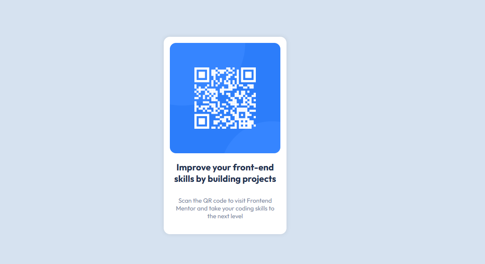

# Frontend Mentor - QR code component solution

This is a solution to the [QR code component challenge on Frontend Mentor](https://www.frontendmentor.io/challenges/qr-code-component-iux_sIO_H). Frontend Mentor challenges help you improve your coding skills by building realistic projects. 

## Table of contents

- [Overview](#overview)
  - [Screenshot](#screenshot)
  - [Links](#links)
- [My process](#my-process)
  - [Built with](#built-with)
  - [What I learned](#what-i-learned)
  - [Continued development](#continued-development)
- [Author](#author)

## Overview

### Screenshot



### Links

- Solution URL: [Repo](https://github.com/thesuperankes/frontendmentor-challenge/tree/challenge/qr)
- Live Site URL: [Github Pages](https://thesuperankes.github.io/frontendmentor-challenge/)

## My process

### Built with

- Semantic HTML5 markup
- CSS custom properties

### What I learned

With HTML I generated a main to cover the whole screen, inside I added a card, with the QR, the title and the paragraph.

```html
<div class="main">
    <div class="card">
      
      <h1 class="card__title">Improve your front-end skills by building projects</h1>
      <p class="card__paragraph">Scan the QR code to visit Frontend Mentor and take your coding skills to the next level</p>
    </div>
  </div>
```

Although I was familiar with media queries in general, I had not used them before.

```css
@media only screen and (max-width: 375px) {
  .card {
    width: 75%;
  }
}

```

In the same way I learned how to import different weights from the font and use it inside the css.

```css
@import url('https://fonts.googleapis.com/css2?family=Outfit:wght@400;700&display=swap');
```

```css
.card__title {
  font-weight: 700;
}

.card__paragraph {
  font-weight: 400;
}

```

### Continued development

I would also like to practice more responsive design and learn good practices for using media queries.

## Author
- Frontend Mentor - [@thesuperankes](https://www.frontendmentor.io/profile/thesuperankes)
- Twitter - [@thesuperankes](https://www.twitter.com/superankes)